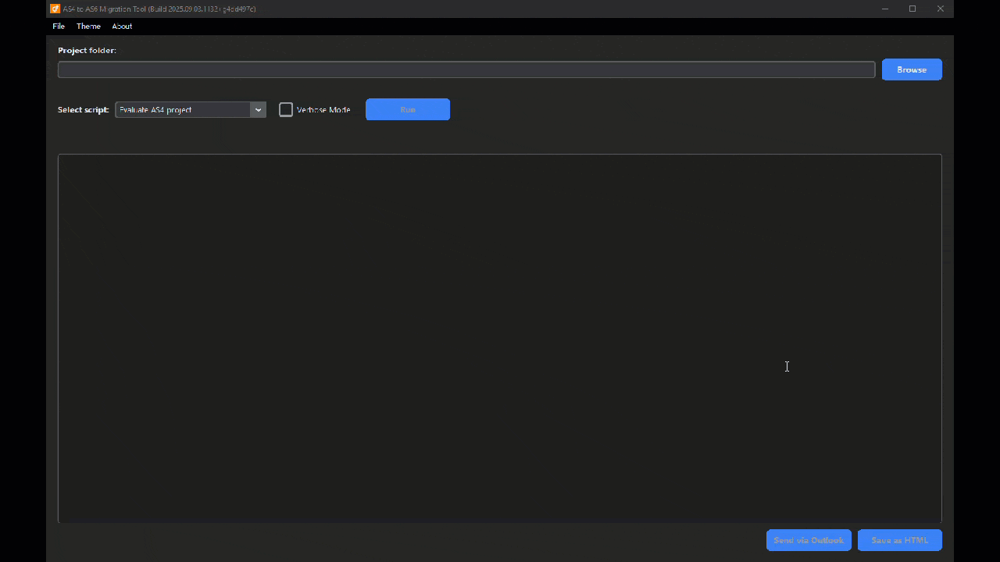

<!-- Logo -->

  <a href="https://github.com/br-automation-community/as6-migration-tools/releases/latest" target="_blank" rel="noopener noreferrer">
    <picture>
      <source media="(prefers-color-scheme: dark)" srcset="docs/logo-dark.svg" />
      
    </picture>
  </a>

<!-- Stats badges -->

  
  
  

  Open-source tools that turn complex Automation Studio migrations into a single, actionable report.

  Detecting deprecated libraries & functions, unsupported hardware, and more.

 

<!-- Demo GIF -->

  

 

<!-- CTAs -->

  
  

 

## Features

- Reduce manual grepping and trial-and-error when opening AS4 projects in AS6.
- Catch breaking changes early: libraries, function blocks/functions, hardware, mapp, and common pitfalls.
- Repeatable, deterministic scans you can run before every commit or release.
- Non-destructive by default: analyze first; apply helper conversions when you’re ready.
- Works fully offline; no telemetry; everything runs locally.
- Fast feedback on large projects; verbose mode for deep dives.
- One clean, shareable report per run (severity + path + hint).
- Windows EXE for one-click usage; Python CLI for power users and CI.

---

## Get started

- **Windows (recommended):** [Download latest release](https://github.com/br-automation-community/as6-migration-tools/releases/latest) → Unzip → Run `as6-migration-tools.exe`
- **From source (devs):** `pip install -r requirements.txt` → `python gui_launcher.py` **or** `python as4_to_as6_analyzer.py "<path>"`

> 💡 **Tip:** If you're using WSL, convert Windows paths like this:  
> `C:\Projects\MyProject` → `/mnt/c/Projects/MyProject`

---

## Included Scripts

| Script                           | Purpose                                                |
|----------------------------------|--------------------------------------------------------|
| `gui_launcher.py`                | GUI for running the scripts                            |
| `as4_to_as6_analyzer.py`         | Main analysis and migration report generator           |
| `helpers/asmath_to_asbrmath.py`  | Replaces deprecated AsMath functions                   |
| `helpers/asstring_to_asbrstr.py` | Replaces deprecated AsString functions                 |
| `helpers/asopcua_update.py`      | Updates OPC UA client code for AR 6 compatibility      |
| `helpers/create_mapp_folders.py` | Creates the newer folders for the mapp components      |
| `helpers/mappmotion_update.py`   | Updates mappMotion code for mappMotion 6 compatibility |

Additional helper scripts may be added in future versions - pull requests welcome.

### Calling a helper script directly

Due to the structure of the project, calling `python helpers/<anyscript>.py` will result in an error.
To prevent this, either use the GUI or change the call to `python -m helpers.<anyscript>` (omit the `.py` extension)

---

## Requirements

- Python 3.12 (tested)
- Designed for Automation Studio 4.12 projects
- Generates reports to assist in migration to Automation Studio 6.x

---

## Limitations

- This tool does not perform full automatic migration of projects.
- It provides analysis and recommendations to assist developers during migration.
- Helper scripts make best-effort changes based on known patterns, but may not cover all edge cases.
- Manual review and validation is always required after running the tool.

---

## Contributing

- Found an issue? Please open a GitHub issue.
- Have ideas or improvements?  
  Fork the repo and submit a pull request - contributions are very welcome!
  - Please run the [black](https://black.readthedocs.io/en/stable/) formatter prior to committing any changes to ensure a consistent style. \
    Hint: PyCharm allows to do so automatically via Settings->Tools->Black

---

## License

> Unofficial project. Not affiliated with or endorsed by B&R Industrial Automation.  
> Provided as-is under the MIT License, without warranty.  
> “B&R” and “Automation Studio” are trademarks of their respective owners.  

💪 Thanks a lot for spending your time helping. Keep rocking 🥂