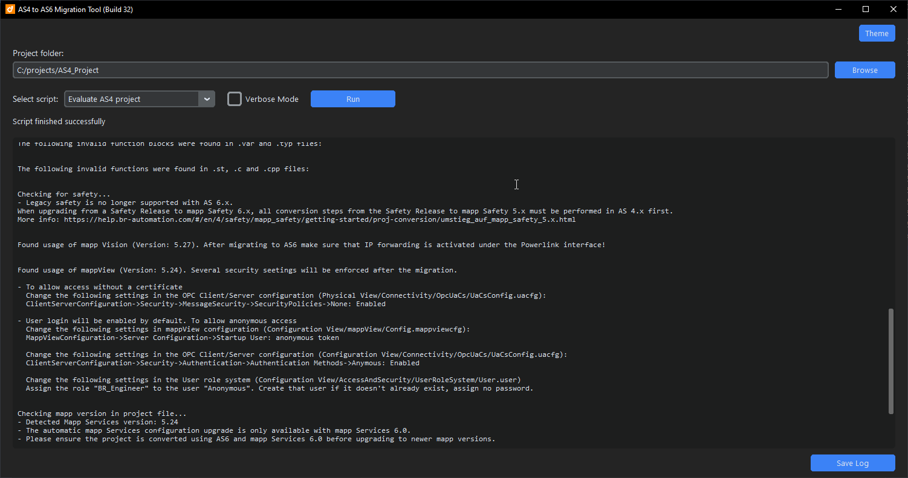
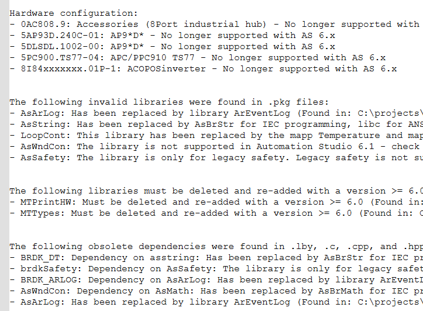

# as6-migration-tools

**Open-source tools for analyzing and migrating B&R Automation Studio 4 (AS4) projects to Automation Studio 6 (AS6).**  
Detects obsolete libraries, unsupported hardware, deprecated functions - and includes helper scripts for automatic code conversion.

> ⚠️ **Disclaimer:** This project is **unofficial** and not provided or endorsed by B&R Industrial Automation.  
> It is offered as an open-source tool, with no warranty or guarantees.  
> Use at your own risk — contributions and improvements are very welcome!

---

## Features

- Analyze AS4 project structure and content
- Detect obsolete and deprecated libraries
- Identify unsupported hardware components
- Find deprecated function blocks and functions
- Suggest library upgrades and replacements
- Check project and hardware file compatibility with AS6
- Includes helper scripts for code migration and conversion  
- Easily extendable to support more patterns and conversions

---

## Usage

Double click the `gui_launcher.py` script to open the GUI. Select the project folder you want to analyze. Select the script you want to run from the dropdown menu, then click "Run".



Run any of the scripts from the command line:

```bash
usage: python as4_to_as6_analyzer.py project_path [options]

Scans Automation Studio project for transition from AS4 to AS6

positional arguments:
  project_path   Automation Studio 4.x path containing *.apj file

options:
  -h, --help     show this help message and exit
  -v, --verbose  Outputs verbose information

```

Example:

Run the main script to analyze an Automation Studio 4 project:

```bash
python as4_to_as6_analyzer.py "C:\path\to\AutomationStudio4Project"
```

Run the script from WSL on a project that is on the Windows partition (replace "C:/" with "/mnt/c/"):  

```bash
python as4_to_as6_analyzer.py "/mnt/c/path/to/AutomationStudio4Project"
```  

---

## Example Output

The `as4_to_as6_analyzer.py` script generates a detailed migration report (saved as `as4_to_as6_analyzer_result.txt` in the project folder).

The report shows which obsolete libraries, hardware components, and function blocks were found - along with suggested actions.

Example (partial output):



---

## Included Scripts

| Script                          | Purpose |
|---------------------------------|---------|
| `gui_launcher.py`           | GUI for running the scripts |
| `as4_to_as6_analyzer.py`           | Main analysis and migration report generator |
| `helpers/asmath_to_asbrmath.py`    | Replaces deprecated AsMath functions |
| `helpers/asstring_to_asbrstr.py`   | Replaces deprecated AsString functions |
| `helpers/asopcua_update.py`        | Updates OPC UA client code for AR 6 compatibility |

Additional helper scripts may be added in future versions — pull requests welcome.

---

## Requirements

- Python 3.12 (tested)
- Designed for Automation Studio 4.12 projects
- Generates reports to assist in migration to Automation Studio 6.x

---

## Limitations

- This tool does not perform full automatic migration of projects.
- It provides analysis and recommendations to assist developers during migration.
- Some helper scripts provide basic automated conversions for known deprecated elements.
- Manual review and validation is always required after running the tool.

---

## Contributing

- Found an issue? Please open a GitHub issue.
- Have ideas or improvements?  
  Fork the repo and submit a pull request - contributions are very welcome!
  - Please run the [black](https://black.readthedocs.io/en/stable/) formatter prior to committing any changes to ensure a consistent style. \
    Hint: PyCharm allows to do so automatically via Settings->Tools->Black

---

## License

MIT License - free to use for personal or commercial purposes.

---

This project aims to help the B&R developer community prepare and streamline the migration from AS4 to AS6. It can be used to analyze projects, plan necessary updates, and identify elements that can be addressed already in AS4 — making the migration process smoother and more predictable. We hope it saves you time — and we welcome all feedback and contributions 🚀.
